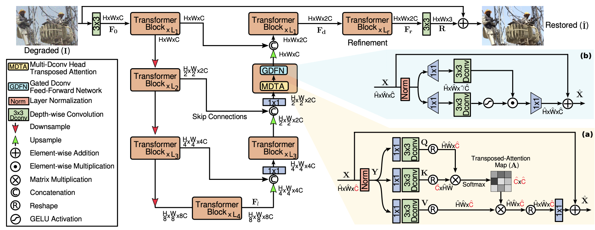

# Restormer

A PyTorch implementation of Restormer based on CVPR 2022 paper
[Restormer: Efficient Transformer for High-Resolution Image Restoration](https://arxiv.org/abs/2111.09881).



## Requirements

- [Anaconda](https://www.anaconda.com/download/)

- [PyTorch](https://pytorch.org)

```
conda install pytorch=1.10.2 torchvision cudatoolkit -c pytorch
```

## Dataset

[Rain100L](https://mega.nz/file/MpgnwYDS#jqyDEyL1U9srLBbEFCPnAOZb2HZTsSrwSvRGQ6m6Dzc),
and [Rain100H](https://www.dropbox.com/s/kzbzer5wem37byg/rain100H.zip?dl=0) are used, download these datasets and make 
sure the directory like this:
```                           
|-- data     
    |-- rain100L
        |-- train
            |-- rain
                norain-1.png
                ...
            `-- norain
                norain-1.png
                ...
        `-- test                                                        
    |-- rain100H
        same as rain100L
```

## Usage

You can easily train and test the model by running the script below. If you want to try other options, please refer to
[utils.py](utils.py).

### Train Model

```
python main.py --data_name rain100L --seed 0
```

### Test Model

```
python main.py --data_name rain100H --model_file result/rain100H.pth
```

## Benchmarks

The models are trained on one NVIDIA RTX A6000 GPU (48G). `num_iter` is `30,000`, `seed` is `1` and `milestone` is
`[9200, 15600, 20400, 24000, 27600]`, the other hyper-parameters are the default values.

<table>
<thead>
  <tr>
    <th rowspan="3">Method</th>
    <th colspan="2">Rain100L</th>
    <th colspan="2">Rain100H</th>
    <th rowspan="3">Download</th>
  </tr>
  <tr>
    <td align="center">PSNR</td>
    <td align="center">SSIM</td>
    <td align="center">PSNR</td>
    <td align="center">SSIM</td>
  </tr>
</thead>
<tbody>
  <tr>
    <td align="center">Ours</td>
    <td align="center">39.94</td>
    <td align="center">0.986</td>
    <td align="center">30.80</td>
    <td align="center">0.903</td>
    <td align="center"><a href="https://mega.nz/folder/z0MzBKLS#eTIvPM6UDNjFAQUOqQ0eKw">MEGA</a></td>
  </tr>
  <tr>
    <td align="center">Ours*</td>
    <td align="center"><b>39.98</b></td>
    <td align="center"><b>0.987</b></td>
    <td align="center"><b>31.96</b></td>
    <td align="center"><b>0.916</b></td>
    <td align="center"><a href="https://mega.nz/folder/61kmTKRY#RuGbKVF9Hngf27jumDmjIQ">MEGA</a></td>
  </tr>
  <tr>
    <td align="center">Official</td>
    <td align="center">38.99</td>
    <td align="center">0.978</td>
    <td align="center">31.46</td>
    <td align="center">0.904</td>
    <td align="center"><a href="https://github.com/swz30/Restormer">Github</a></td>
  </tr>
</tbody>
</table>

Due to the huge demand for GPU memory, we have to reduce the `batch_size` and `patch_size`:

`Ours`: `batch_size` is `[64, 40, 32, 16, 8, 8]` and `patch_size` is `[32, 40, 48, 64, 80, 96]`;

`Ours*`: `batch_size` is `[32, 20, 16, 8, 4, 4]` and `patch_size` is `[64, 80, 96, 128, 160, 192]`.

## Results

More results could be downloaded from [MEGA](https://mega.nz/folder/qglyxAwB#2hgvj4o-NwCZVfcTuKFkFg). Here we give some
examples for `Ours*`.


